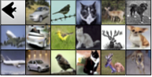
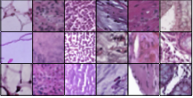
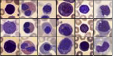
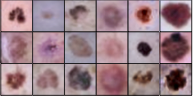
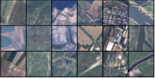
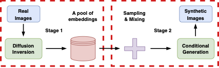

# Diffusion Inversion

[Project Page](https://sites.google.com/view/diffusion-inversion) 
| [ArXiv](https://arxiv.org/abs/2305.15316)

This repo contains code for steer Stable Diffusion Model to generate data for downstream classifier training. Please see our paper and project page for more results.

<p align="middle">








</p>

## Abstract
Acquiring high-quality data for training discriminative models is a crucial yet challenging aspect of building effective predictive systems. In this paper, we present Diffusion Inversion, a simple yet effective method that leverages the pre-trained generative model, Stable Diffusion, to generate diverse, high-quality training data for image classification. Our approach captures the original data distribution and ensures data coverage by inverting images to the latent space of Stable Diffusion, and generates diverse novel training images by conditioning the generative model on noisy versions of these vectors. We identify three key components that allow our generated images to successfully supplant the original dataset, leading to a 2-3x enhancement in sample complexity and a 6.5x decrease in sampling time. Moreover, our approach consistently outperforms generic prompt-based steering methods and KNN retrieval baseline across a wide range of datasets. Additionally, we demonstrate the compatibility of our approach with widely-used data augmentation techniques, as well as the reliability of the generated data in supporting various neural architectures and enhancing few-shot learning.

## Method
Stable Diffusion, a model trained on billions of image-text pairs, boasts a wealth of generalizable knowledge. To harness this knowledge for specific classification tasks, we propose a two-stage method that guides a pre-trained generator, $G$, towards the target domain dataset. In the first stage, we map each image to the model's latent space, generating a dataset of latent embedding vectors. Then, we produce novel image variants by running the inverse diffusion process conditioned on perturbed versions of these vectors. We illustrate our approach in Figure below.
<p align="middle">

</p>

## Reproducing
### Environment

- You can set up the environment using the command below.

```bash
conda env create -f environment.yaml
conda activate di
```

### Training

```bash
path="--pretrained_model_name_or_path=CompVis/stable-diffusion-v1-4 --output_dir=$PROJDIR/diffusion_inversion/logs/stl10 --dataset_name=stl10 --data_dir=~/tensorflow_datasets"
args="--gradient_accumulation_steps=1 --num_tokens=5 --resolution=256 --train_batch_size=50 --num_emb=100 --max_train_steps=8000"
lr="--lr_warmup_steps=0 --interpolation=bicubic --lr_scheduler=constant --learning_rate=3e-02"
log="--checkpointing_steps=1000 --save_steps=1000 --save_image_steps=400 --resume_from_checkpoint=latest"

accelerate launch src/diffuser_inversion.py $path $args $lr $log --group_id=0
...
accelerate launch src/diffuser_inversion.py $path $args $lr $log --group_id=50
```

### Sampling

```bash
path="--dataset_name=stl10 --model_root_dir=$PROJDIR/diffusion_inversion/logs/stl10/res256_bicubic/emb100_token5_lr0.03_constant --dm_name=CompVis/stable-diffusion-v1-4"
train_config="--emb_ch=768 --num_tokens=5 --num_classes=10 --num_emb=100 --sampling_resolution=256 --save_resolution=96  --outdir=$PROJDIR/inversion_data/stl10/scaling"
sampling_config="--num_inference_steps=100 --batch_size=100 --interpolation_strength=0.1 --num_samples=5 --emb_noise=0.1 --train_steps=3000 --seed=42"

python sample_dataset.py $path $train_config $sampling_config --group_id=0
...
python sample_dataset.py $path $train_config $sampling_config --group_id=50
```

### Evaluation
```bash
path="--output=$PROJDIR/project/diffusion_inversion/arch"
stl10="--dataset-name=stl10 --group-size=100 --num-steps=50000"
pstl10="--syn-data-dir=$PROJDIR/inversion_data/stl10/scaling/res96_bicubic --syn-pattern=tstep[0-9]*_infstep100_gs[0-9]*_noise0.[0-9]*_itep0.[0-9]*_seed[0-9]*"
args="--batch-size=128 --warmup-steps=1000 --num-data=5000 --num-steps=50000 --optimizer=sgd --weight-decay=5e-4 --real-bs=0 --syn-bs=128"
log="--num-evals=20 --seed=42 --wandb-name=DI-stl10 --log-wandb" 

# Train on real data
python train_net.py $path $stl10 $args $log --model=resnet18 --lr=1e-1

# Train on synthetic data
python train_net.py $path $stl10 $pstl10 $args $log --model=resnet18 --lr=1e-1
```

<!-- ## Citation
```bibtex
```

## Acknowledgement -->